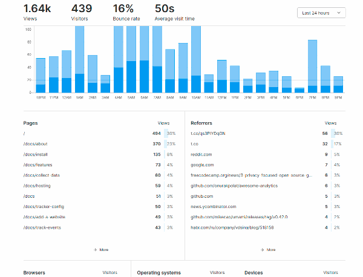

<!--
Ohart ongi: README hau automatikoki sortu da <https://github.com/YunoHost/apps/tree/master/tools/readme_generator>ri esker
EZ editatu eskuz.
-->

# Umami YunoHost-erako

[](https://dash.yunohost.org/appci/app/umami)  

[](https://install-app.yunohost.org/?app=umami)

*[Irakurri README hau beste hizkuntzatan.](./ALL_README.md)*

> *Pakete honek Umami YunoHost zerbitzari batean azkar eta zailtasunik gabe instalatzea ahalbidetzen dizu.*  
> *YunoHost ez baduzu, kontsultatu [gida](https://yunohost.org/install) nola instalatu ikasteko.*

## Aurreikuspena

Umami is a simple, easy to use, self-hosted web analytics solution. The goal is to provide you with a friendlier, privacy-focused alternative to Google Analytics and a free, open-sourced alternative to paid solutions. Umami collects only the metrics you care about and everything fits on a single page. 

### Features

- Simple analytics
- Unlimited websites
- Bypass ad-blockers
- Light-weight
- Multiple accounts
- Share data
- Mobile-friendly
- Data ownership
- Privacy-focused


**Paketatutako bertsioa:** 2.11.1~ynh1

**Demoa:** <https://app.umami.is/share/8rmHaheU/umami.is>

## Pantaila-argazkiak



## Dokumentazioa eta baliabideak

- Aplikazioaren webgune ofiziala: <https://umami.is/>
- Administratzaileen dokumentazio ofiziala: <https://umami.is/docs/about>
- Jatorrizko aplikazioaren kode-gordailua: <https://github.com/mikecao/umami>
- YunoHost Denda: <https://apps.yunohost.org/app/umami>
- Eman errore baten berri: <https://github.com/YunoHost-Apps/umami_ynh/issues>

## Garatzaileentzako informazioa

Bidali `pull request`a [`testing` abarrera](https://github.com/YunoHost-Apps/umami_ynh/tree/testing).

`testing` abarra probatzeko, ondorengoa egin:

```bash
sudo yunohost app install https://github.com/YunoHost-Apps/umami_ynh/tree/testing --debug
edo
sudo yunohost app upgrade umami -u https://github.com/YunoHost-Apps/umami_ynh/tree/testing --debug
```

**Informazio gehiago aplikazioaren paketatzeari buruz:** <https://yunohost.org/packaging_apps>
