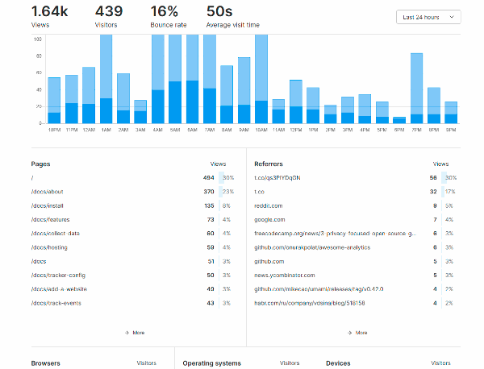

<!--
N.B.: README ini dibuat secara otomatis oleh <https://github.com/YunoHost/apps/tree/master/tools/readme_generator>
Ini TIDAK boleh diedit dengan tangan.
-->

# Umami untuk YunoHost

[](https://ci-apps.yunohost.org/ci/apps/umami/)


[](https://install-app.yunohost.org/?app=umami)

*[Baca README ini dengan bahasa yang lain.](./ALL_README.md)*

> *Paket ini memperbolehkan Anda untuk memasang Umami secara cepat dan mudah pada server YunoHost.*  
> *Bila Anda tidak mempunyai YunoHost, silakan berkonsultasi dengan [panduan](https://yunohost.org/install) untuk mempelajari bagaimana untuk memasangnya.*

## Ringkasan

Umami is a simple, easy to use, self-hosted web analytics solution. The goal is to provide you with a friendlier, privacy-focused alternative to Google Analytics and a free, open-sourced alternative to paid solutions. Umami collects only the metrics you care about and everything fits on a single page. 

### Features

- Simple analytics
- Unlimited websites
- Bypass ad-blockers
- Light-weight
- Multiple accounts
- Share data
- Mobile-friendly
- Data ownership
- Privacy-focused


**Versi terkirim:** 2.14.0~ynh1

**Demo:** <https://app.umami.is/share/8rmHaheU/umami.is>

## Tangkapan Layar



## Dokumentasi dan sumber daya

- Website aplikasi resmi: <https://umami.is/>
- Dokumentasi admin resmi: <https://umami.is/docs/about>
- Depot kode aplikasi hulu: <https://github.com/mikecao/umami>
- Gudang YunoHost: <https://apps.yunohost.org/app/umami>
- Laporkan bug: <https://github.com/YunoHost-Apps/umami_ynh/issues>

## Info developer

Silakan kirim pull request ke [`testing` branch](https://github.com/YunoHost-Apps/umami_ynh/tree/testing).

Untuk mencoba branch `testing`, silakan dilanjutkan seperti:

```bash
sudo yunohost app install https://github.com/YunoHost-Apps/umami_ynh/tree/testing --debug
atau
sudo yunohost app upgrade umami -u https://github.com/YunoHost-Apps/umami_ynh/tree/testing --debug
```

**Info lebih lanjut mengenai pemaketan aplikasi:** <https://yunohost.org/packaging_apps>
